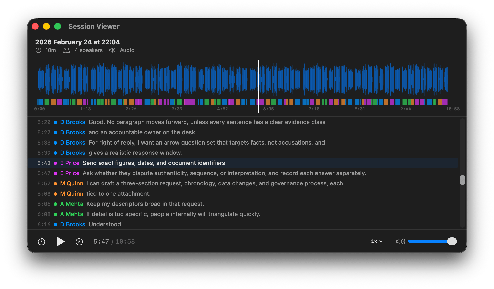
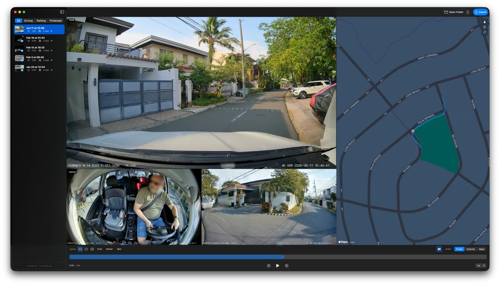

# Johan Thorén

I build practical software end to end: commercial macOS products, AI-agent tooling, and infrastructure/monitoring libraries, mostly in Swift and Rust.

## Commercial products

### [Parrot Scribe](https://parrotscribe.com)

**Status:** active commercial product, private source

**What it is:** a macOS transcription and productivity app, built solo from app to website to licensing.

**Stack:**
- **macOS app:** Swift, SwiftUI/AppKit, AVFoundation, Sparkle, KeyboardShortcuts
- **Transcription:** WhisperKit
- **Persistence and licensing:** GRDB/SQLite, CryptoKit/Security
- **Backend tooling:** Rust license server, SQLite
- **Website:** Next.js, React, TypeScript, MDX, Cloudflare/OpenNext
- **Testing:** XCTest, Playwright, Vitest

### [Dashcam Export](https://dashcamexport.com)

**Status:** shipped commercial product, private source

**What it is:** a native macOS dashcam footage manager for session navigation and export, built solo.

**Stack:**
- **macOS app:** Swift, SwiftUI/AppKit, AVFoundation/AVKit, CoreMedia
- **Video and location:** VideoToolbox, Metal, MapKit/CoreLocation
- **Persistence and commerce:** GRDB/SQLite, StoreKit
- **Build and release:** XcodeGen, fastlane
- **Website:** Next.js, React, TypeScript, Cloudflare/OpenNext
- **Testing:** XCTest, Swift Testing, Playwright, Vitest

## Open source

### Actively maintained

#### [jeff](https://github.com/johanthoren/jeff)

**Status:** actively maintained open source

**Stack:** Bash, Bats, Python, Make, jq, git/GitHub workflow tooling

**What it is:** a task pipeline for coding agents: capture, plan, test, implement, refactor, review, audit, and validate before calling work done.

#### [logmv](https://github.com/johanthoren/logmv)

**Status:** actively maintained open source

**Stack:** Rust 2024, clap, serde/JSONL, chrono, thiserror

**What it is:** logged atomic file move and trash operations with an append-only JSON-Lines audit trail, built for safer autonomous-agent file operations.

#### [geneos-toolkit-rs](https://github.com/ITRS-Group/geneos-toolkit-rs)

**Status:** actively maintained open source at ITRS Group

**Stack:** Rust 2024, optional AES/CBC/zeroize secure environment support, proptest/pretty_assertions tests

**What it is:** a Rust library for building Geneos Toolkit-compatible applications, written with a small dependency surface for regulated production environments.

#### [geneos-xtender](https://github.com/ITRS-Group/geneos-xtender)

**Status:** actively maintained open source at ITRS Group; pre-release preview / best-effort support

**Stack:** Rust, clap, tokio/futures, serde JSON/YAML, CSV, OpenSSL, perfdata, assert_cmd/predicates tests

**What it is:** a CLI and library that runs Nagios-compatible plugins asynchronously and formats their output for the Geneos Toolkit Plugin.

### Other public work

- [opsview-rs](https://github.com/johanthoren/opsview-rs) - Rust Opsview API client. Stack: Rust, reqwest, tokio, serde, criterion, mockito/httpmock.
- [voxtus](https://github.com/johanthoren/voxtus) - transcription CLI for YouTube and local media. Stack: Rust, whisper-rs, yt-dlp, tokio, clap.
- [bibcal](https://github.com/johanthoren/bibcal), [luminary](https://github.com/johanthoren/luminary), [org.bibcal.www](https://github.com/johanthoren/org.bibcal.www) - biblical calendar libraries, CLI, and website. Stack: Clojure, Leiningen, tick, Ring/Compojure/Hiccup, Docker, GraalVM native image.
- [solar-calendar-events](https://github.com/johanthoren/solar-calendar-events) - Rust library for equinoxes and solstices.
- [check_jitter](https://github.com/johanthoren/check_jitter) and [check_macos_updates](https://github.com/johanthoren/check_macos_updates) - Nagios/Opsview-style monitoring plugins. Stack: Rust, clap, nagios-range.
- [kjv-org](https://github.com/johanthoren/kjv-org) - Authorized King James Version in Org mode.
- [combine-dashcam-cameras](https://github.com/johanthoren/combine-dashcam-cameras) - Python utility for combining separate dashcam camera folders into VIOFO-style outputs.

### Archived or complete

- [parrotscribe-mcp](https://github.com/johanthoren/parrotscribe-mcp) - archived MCP server for early Parrot Scribe agent integration. Stack: TypeScript, Node.js, Model Context Protocol SDK, Vitest.

## Enterprise background

Eight years at ITRS working with banks and exchanges across support, presales, and customer solutions. That work shaped my bias toward operable systems, clear diagnostics, boring automation, and software that survives contact with production users.

## Current focus

AI-agent workflows, auditable automation, retrieval/evaluation systems, macOS products, and practical developer tooling.

Based in Manila, working globally.

[LinkedIn](https://www.linkedin.com/in/johan-thoren)
